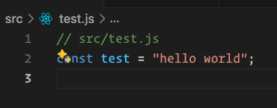

# File Path Commenter README

Effortlessly add relative file path comments to the top of your code files with the File Path Commenter extension for Visual Studio Code. This extension is designed to enhance your workflow, especially when leveraging large language models (LLMs) such as ChatGPT, Claude, and other AI assistants to write and manage your code.

## Features

- **Automatic File Path Comments:** Automatically insert the relative path of your file as a comment at the top of your code files upon opening.
- **Language Support:** Supports a wide range of programming languages including JavaScript, TypeScript, Python, Java, C, C++, C#, HTML, CSS, PHP, Ruby, Perl, Lua, and many more.
- **Duplicate Prevention:** Ensures the comment is only added if it doesn't already exist, preventing duplicate comments.
- **Customizable Include Paths:** Specify which directories should have file path comments added.



## Requirements

No additional requirements or dependencies are needed for this extension.

## Extension Settings

This extension contributes the following settings:

- `filePathCommenter.includePaths`: (Default: `["src"]`) - An array of paths to include for file path comments. Paths are relative to the workspace root .
- `filePathCommenter.pathSeparator`: (Default: `"auto"`) - A string to define what separator to use: 
    - `"auto"` - (use OS separator, `/` for Unix-based systems, `\` for Windows), 
    - `"forward"` - (`/`)
    - `"backward"` - (`\`).

By default, only files in the "src" folder will have comments added. You can customize this behavior in your VS Code settings.

### How to Customize Include Paths

1. Open VS Code Settings (File > Preferences > Settings)
2. Search for "File Path Commenter"
3. Find the "Include Paths" setting
4. Click on "Edit in settings.json"
5. Add or modify the `filePathCommenter.includePaths` array. For example:

```json
{
  "filePathCommenter.includePaths": ["src", "tests", "lib"]
}
```
This configuration will add file path comments to files in the "src", "tests", and "lib" directories and their subdirectories.

### How to Customize Separator

1. Open VS Code Settings (File > Preferences > Settings)
2. Search for "File Path Commenter"
3. Find the "Separator" setting
4. Click on "Edit in settings.json"
5. Add or modify the `filePathCommenter.pathSeparator` string. For example:

```json
{
  "filePathCommenter.pathSeparator": "forward"
}
```


## Known Issues

There are no known issues at this time. If you encounter any problems, please open an issue on the GitHub repository.

## Release Notes

1.0.0
Initial release of File Path Commenter.

1.1.0
Added customizable include paths feature.

1.2.0
Added customizable separator feature.